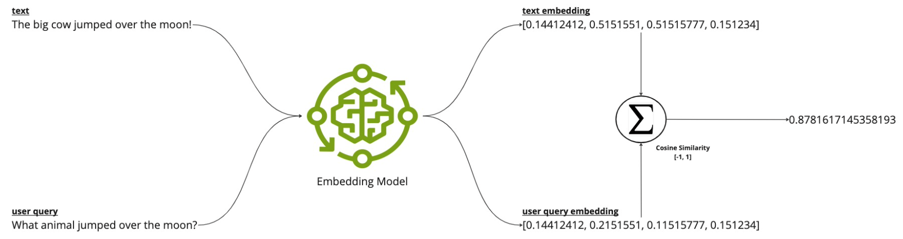
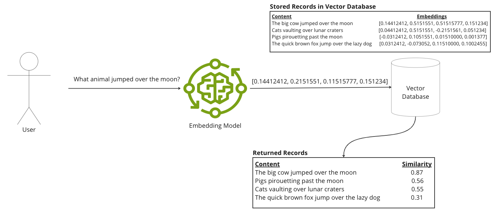
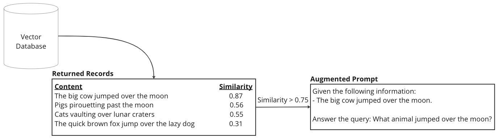
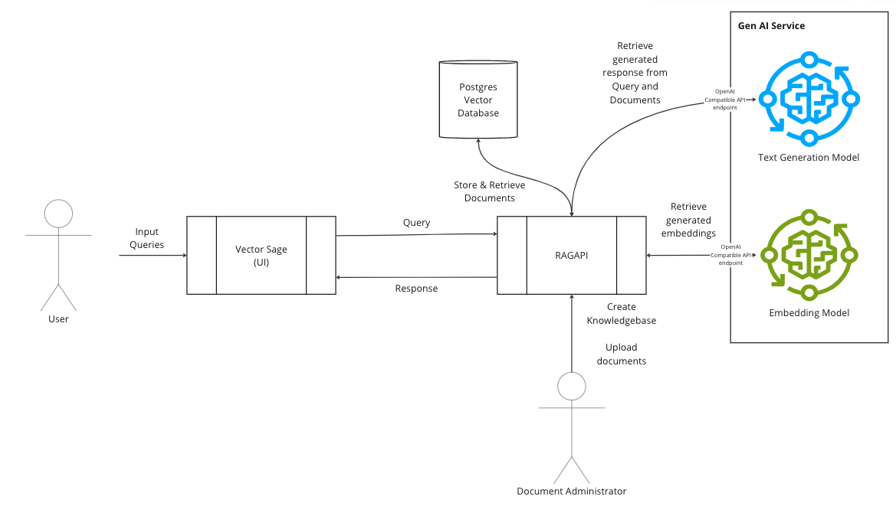

# VectorSage

VectorSage is a Retrieval Augmented Generation (RAG) application that leverages dense embeddings for retrieving information from a document set. This application demonstrates the power of RAG with the Gen AI Tile and the Postgres Tile on TAS. It also introduces Knowledge bases, where it is possible to allow users to select specific Knowledge context of topics to make queries against. For example, one for Cloud Foundry and another for baking bread. 

## Getting Started

To deploy and use VectorSage, follow these steps:

1. Ensure that the Gen AI Tile and Postgres Tiles are installed on your TAS foundation.
2. Use Cloud Foundry CLI to log in (`cf login`).
3. Target your desired org and space (`cf target -o <org-name> -s <space-name>`).
4. Run the `setup.sh` script. This script will:
   - Create a GenAI service instance.
   - Create a Postgres service instance.
   - Deploy VectorSage and its corresponding REST app, RAGAPI.
   - Create an entry in the Open Source Cloud Foundry Knowledge Base.
   - Upload Cloud Foundry documents, process their embeddings, and store them in the Postgres database.
5. Upon completion, two URLs will be displayed: one for VectorSage and another for RAGAPI. Access the VectorSage URL to start using the chat/question interface.

## Swagger UI

Access the Swagger UI for RAGAPI at `https://ragapi.<apps-domain>/`. This interface allows you to explore and interact with the API endpoints directly.

## Features

These features can be accessed via the Swagger UI but will be explained further using curl for command line interaction.

### Knowledge Base

Every set of input content/document needs to be part of a Knowledge base. A knowledge base is simply a representation of a separate table holding context and pre-computed embeddings. The following inputs are available to create Knowledge base.

* **Topic Display Name**: The name to be displayed on the UI
* **Topic Domain**: A single world to describe the topic's domain. e.g. Science, Medicine. Note that setup.sh inputs `Cloud Foundry`, which will be converted into a single world `Cloud_Foundry`
* **Vector Size (default 768)**: Used to indicate the length of a single embedding vector. This varies from model and needs to be pre-determined.
* **Context Learning (Optional)**: Allows input for in-context learning that provides a set of examples to help condition a language model before processing further queries to help improve it's output[1]. For example, show the language model that you're doing language translation, give a few examples and then do a prompt asking to translate another text:

```json
[
  {
    "role": "user",
    "content": "Translate 'Hello, how are you?' to French."
  },
  {
    "role": "assistant",
    "content": "Bonjour, comment ça va?"
  },
  {
    "role": "user",
    "content": "Translate 'What is your name?' to French."
  },
  {
    "role": "assistant",
    "content": "Comment vous appelez-vous?"
  },
  {
    "role": "user",
    "content": "Translate 'What is your favourite food?' to French."
  },
]
```

A knowledge base can be created with curl:

```bash
curl -X POST "https://ragapi.<domain>/create_knowledge_base" -d "topic_display_name=Cloud Foundry OSS Docs&vector_size=768&topic_domain=Cloud Foundry" \
-d 'context_learning=[
            {
                "role": "user",
                "content": "Who are you? Or what are you?"
            },
            {
                "role": "assistant",
                "content": "I am an assistant on Cloud Foundry topics."
            },
            {
                "role": "user",
                "content": "What does CF stand for?"
            },
            {
                "role": "assistant",
                "content": "CF is Cloud Foundry."
            }
        ]'
```

### Uploading Markdown Documents

Support is currently only for Markdown text documents. This process will upload the files, chunk them, create embeddings and store then into the Postgres database. Documents should be well cleaned and provide useful information .e.g, convert URL links from relative to absolute.  The following inputs are available to upload files.

* **Topic Display Name**: The name to be displayed on the UI
* **Files**: A set of files to upload using POST Form.   
* **Token Chunk Size (default 512))**: Chunking is always on a sentence granularity with one prior sentence overlap. This input is used to control the amount of chunking based on token counting. The chunking algorithm adapts the embedding model's tokenizer to count the number of tokens processed and limits a chunk to this size. For good results, this size should be limited to the number of tokens that an embedding model was trained for. e.g, `hkunlp/instructor-xl` was trained on 512 token inputs. 

Files can be uploaded using curl:
```bash
curl -X POST  "https://ragapi.<domain>/upload_files" -F 'topic_display_name=Cloud Foundry OSS Docs' -F "files=@buildpacks.md" -F "files=@listing-feature-flags.md" -D 'token_chunk_size=512'
```

## Concepts & Architecture

### Dense Embedding Search



In natural language processing (NLP), an embedding[2] is a vector representing words or sentences, capturing their semantic (e.g. synonyms) and contextual (e.g. word usage, orders and syntax such as the word `bank` could mean `land alongside to a river` or `a financial institution` depending on its context) relationships. Dense embeddings are compact vector elements typically with 300 to 1000s of numbers, with most numbers being non-zero. These embeddings allow machine learning models to efficiently process and retrieve information. A system would compare user queries, converted into embeddings, with pre-computed document embeddings using a measure, such as cosine similarity, to find relevant document sections. Such embeddings are typically generated by embedding models that have been trained to capture the semantic and contextual relationships verses those used for chatting. As such, the user queries must use the same specific embedding model to compare against the pre-computed document embeddings. 

### Retrieval Augmented Generation (RAG)

RAG[3] enhances responses from generative models through a three-step process:
1. **Retrieval**: Searches a large document corpus to find sections most relevant to the user's query, using techniques like dense embedding search or a combination thereof. 


1. **Augmentation**: Provides these retrieved document excerpts as context to the generative models, allowing them to access and incorporate information they were not originally trained on.


1. **Generation**: Enhances the model's output with this augmented information, leading to more accurate and detailed responses.


### Architecture

VectorSage consists of two main components:
1. **RAGAPI**: Handles UI requests, database interactions, and inference operations using the GenAI tile. It is connected to both the Postgres database and the GenAI service. The GenAI tile supports multiple inference models and utilizes an OpenAI compatible REST API. Therefore, application bounded to the GenAI service instance can simply utilize the OpenAI libraries to send requests to the GenAI service together with specific model names.  In this application, we utilize the [`hkunlp/instructor-xl`](https://huggingface.co/hkunlp/instructor-xl) model for embedding generation and the [`mistralai/Mistra- 7B-Instruct-v0.2`](https://huggingface.co/mistralai/Mistral-7B-Instruct-v0.2) model for text generation. 

1. **VectorSage UI**: Is a Gradio UI that supports streaming interactions and is decoupled from direct backend services such the Postgres database and Gen AI service.



## References

[1] T. B. Brown, B. Mann, N. Ryder, M. Subbiah, J. Kaplan, P. Dhariwal, A. Neelakantan, P. Shyam, G. Sastry, A. Askell, S. Agarwal, A. Herbert-Voss, G. Krueger, T. Henighan, R. Child, A. Ramesh, D. M. Ziegler, J. Wu, C. Winter, C. Hesse, M. Chen, E. Sigler, M. Litwin, S. Gray, B. Chess, J. Clark, C. Berner, S. McCandlish, A. Radford, I. Sutskever, D. Amodei, "Language Models are Few-Shot Learners," in Advances in Neural Information Processing Systems 33: Annual Conference on Neural Information Processing Systems 2020, NeurIPS 2020, December 6-12, 2020, virtual, H. Larochelle, M. Ranzato, R. Hadsell, M.-F. Balcan, H.-T. Lin, Eds. 2020. [Online]. Available: https://proceedings.neurips.cc/paper/2020/hash/1457c0d6bfcb4967418bfb8ac142f64a-Abstract.html 

[2] Y. Bengio, R. Ducharme, P. Vincent, and C. Janvin, "A Neural Probabilistic Language Model," J. Mach. Learn. Res., vol. 3, pp. 1137-1155, Mar. 2003. [Online]. Available: http://dl.acm.org/citation.cfm?id=944919.944966

[3] P. Lewis, E. Perez, A. Piktus, F. Petroni, V. Karpukhin, N. Goyal, H. Küttler, M. Lewis, W.-t. Yih, T. Rocktäschel, S. Riedel, and D. Kiela, "Retrieval-Augmented Generation for Knowledge-Intensive NLP Tasks," in Advances in Neural Information Processing Systems 33, H. Larochelle, M. Ranzato, R. Hadsell, M.F. Balcan, and H. Lin, Eds. Curran Associates, Inc., 2020, pp. 9459–9474. [Online]. Available: https://proceedings.neurips.cc/paper_files/paper/2020/file/6b493230205f780e1bc26945df7481e5-Paper.pdf


## Acknowledgements

Andrew Wood and Kevin Mackett for their continued discussions, CF docs scraper and pairing on the first iteration of this sample.